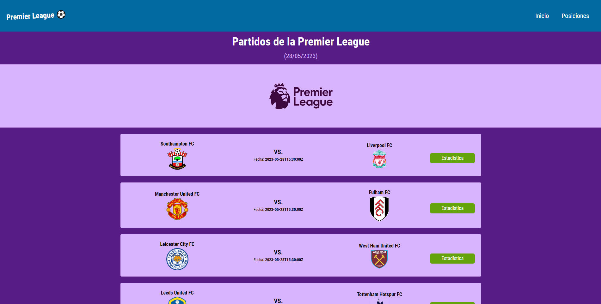

## Table of contents

- [Overview](#overview)
  - [Screenshot](#screenshot)
  - [Links](#links)
- [My process](#my-process)
  - [Built with](#built-with)
  - [What I learned](#what-i-learned)
- [Author](#author)

## Overview

### Screenshot

### Links

- Live Site URL: [Netlify](https://footballdata-bybruse.netlify.app/)⚽

## My process

### Built with

- Semantic HTML5 markup
- CSS custom properties
- TailwindCSS
- React
- Mobile-first workflow
- Fetch
- [API LINK](https://www.football-data.org/)

### What I learned

Lately I was focused on learning Tailwind so I decided to practice with this project. It is still a framework that I don't know a lot about, but I liked the idea and the organization. I was able to keep pace and order in such a short time.

## Author

- GitHub - [@brujavsen]